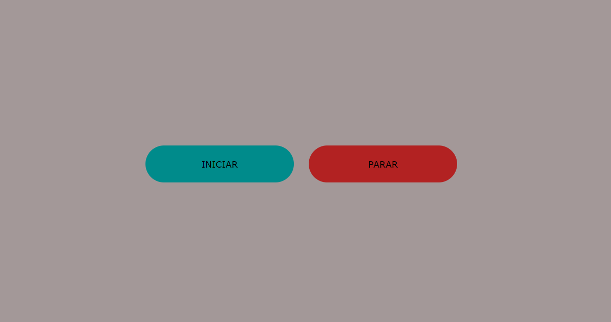
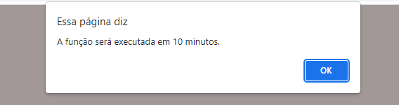

# EVITAR A SUSPENSÃO AUTOMÁTICA DO SISTEMA 
Projeto criado com o objetivo de evitar que a máquina suspenda o login do sistema Windows após um período de inatividade, a fim de permitir que outras atividades não sejam interrompidas.

O projeto consiste em dois botões: um que inicia uma função que abre uma página HTML vazia automaticamente a cada dez minutos; e outro que fecha a própria página para parar este processo.

